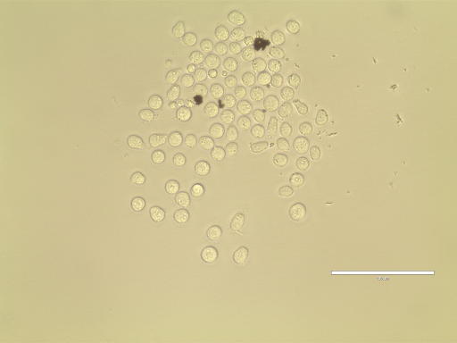
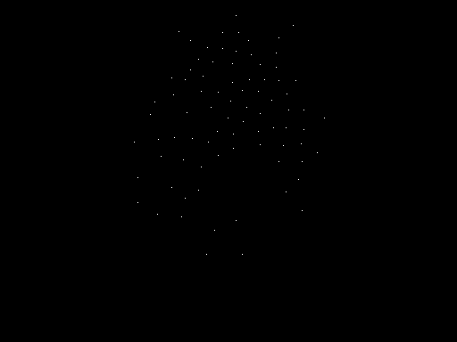

# U-NET modified for density kernel estimation

U-NET is a popular end-to-end segmentation net used in biomedical imaging [1]. Following a suggestion from a friend (Weidi Xie) I wanted to see if this network structure could be used to perform density estimation. I took the U-NET implementation from Weidi. With some small changes and some basic pre-processing I have been able to achieve close to state-of-the-art performance.

#### Background:

By using machine learning it is possible to learn a mapping from intensity to a density kernel representation of cells and objects. Through integration of the densities one can then predict the number of cells of objects in a scene without having to explicity segment the objects of interest. [2] To do this accurately, for typical images, it is necessary to characterise the image pixels by calculating long feature descriptors which can abstract image information in different ways and at different scales. Neural networks can handle large training sets and learn features which are tuned for specific applications. Many different networks can be applied to this problem however the current state-of-the-art for density kernel estimation in 2-D is a Fully Convolutional Regression Neural Network [3] which comprises of convolutional layers along with the normal activation and pooling layers, but then has upsampling layers which allow the output of the network to expand to be in parity with the input dimension. U-NET is a fully convolutional network also but it uses concatenations of layers and a highly symmetrical network design. I was interested to see if this could be directly applied to the density estimation and how well it would peform.

#### Changes:

-- The loss function used is 'mse' not 'cross-entropy'.

-- As I am not performing segmentation so don't use softmax and use relu rather than sigmoid in the last activation layer.

-- As mentioned in [2] it is important to scale the density kernels from 0.0-1.0 to something higher ( in this case 0.0-255.0) otherwise the network struggles to learn the very small target values produced by Gaussian convolution. These values are down-scaled subsequently to valid densities (0.0-1.0).

#### Datasets:

I used one some of a dataset which I have recieved from a collaborator (Caroline Scott). These are cells imaged using bright-field microscopy. We are interested in how many cells are present in each image.

 

#### Bibliography:

[1] Ronneberger, Olaf, Philipp Fischer, and Thomas Brox. "U-net: Convolutional networks for biomedical image segmentation." International Conference on Medical Image Computing and Computer-Assisted Intervention. Springer International Publishing, 2015.

[2] Lempitsky, Victor, and Andrew Zisserman. "Learning to count objects in images." Advances in Neural Information Processing Systems. 2010.

[3] Xie, Weidi, J. Alison Noble, and Andrew Zisserman. "Microscopy Cell Counting with Fully Convolutional Regression Networks."